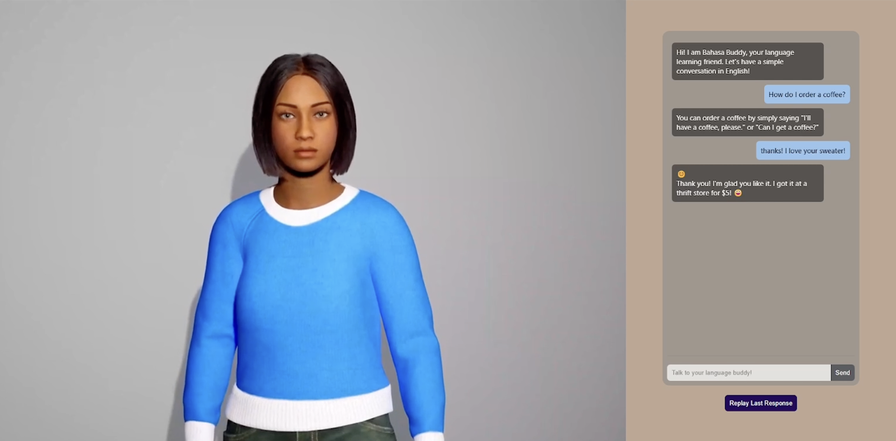

# AI-Driven Virtual Avatars
## Introduction
This repository contains all the files for the Proof of Concept (POC) of our AI-Driven Avatars Project. Follow the instructions below to set up and run the project locally.

<p align="center">
    
    <br>
    Screenshot of our Proof of Concept
</p>

**Note**: This project requires a device with sufficient GPU memory and a compatible CUDA installation.

## Access our demo videos
You can view some demo videos of our POC on our [YouTube playlist](https://youtube.com/playlist?list=PLopFiGjXtoU1K1Oa2MK6S6JiY1zNR-5u3&si=4BveFoR-_C0o59OS).

## Instructions to run the code
### 1. Creating a virtual environment
To run the UI, you need to create a virtual environment with specifically [**Python 3.9.2**](https://www.python.org/downloads/release/python-392/) and activate it. To run the UI, create a virtual environment using Python 3.9.2. Ensure Python 3.9.2 is installed on your machine. If not, install it via:

- MacOS:
    ```
    brew install python@3.9
    ```

- Windows:
    ```
    choco install python --version=3.9.2
    ```

Navigate to the project directory: ``` cd [folder path]```, and run the following commands:
- MacOS:
    ```
    python3.9 -m venv venv2
    source venv2/bin/activate
    ```

- Windows:
    ```
    python3.9 -m venv venv2
    venv2/Scripts/activate
    ```

### 2. Installing PyTorch
Install a compatible version of PyTorch based on your CUDA version. For example, if using CUDA 12.6:
``` 
pip install torch==2.1.0+cu121 --index-url https://download.pytorch.org/whl/cu121 
```

You can verify that PyTorch is using CUDA by running:
```
python check_cuda.py
```

### 3. Installing *FFmpeg*
FFmpeg is required for Wav2Lip. Install it as follows:
- MacOS:
    ```
    brew install ffmpeg
    ```
- Windows: Download it directly from [FFmpeg's website](https://www.ffmpeg.org/download.html) and ensure its path is added to the system's environment variables.

### 3. Installation of other dependencies
Install all other required dependencies listed in *requirements.txt*.
```
pip install -r requirements.txt
```

### 4. Add Wav2Lip files
Download the Wav2Lip zip file at [this link](https://drive.google.com/file/d/13cwrAED4l-x-Cf2veB4O28I2j_sNxDhk/view?usp=sharing),
extract the contents and insert them in the project folder. 

This is a modified version of the [Wav2Lip repository by Rudrabha](https://github.com/Rudrabha/Wav2Lip), with an additional file *inference_adjusted.py*.

### 5. Running the UI
Make sure the previous 4 steps are completed, then run the UI on a local server with
```
python app.py
```

Wait for it to finish loading. Then open this link your browser in an incognito tab: ```http://127.0.0.1:5000/```. The UI should be running smoothly.


## Troubleshooting
### *FFmpeg* issues on Windows
The usage of FFmpeg on MacOS should be straightforward. But on a windows laptop, you might need to follow additional steps to make sure its path is added to the system environment variables and the $PROFILE for the terminal. 

### Dependency conflicts
The dependencies will have a few inevitable but minor conflicts, such as between *librosa*, *numpy* and *scipy*.
However, these should not affect the functionality of the code.